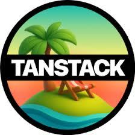

By onboarding with us, you will have to conform to certain libraries that had been specially curated through deep research, comparison and multiple Proof of Concepts.

This might seem very restrictive at first but this is how we can keep TSC well governed, providing users a more unified and simplistic user experience as well as keeping developer experience more consistent.

## TypeScript

The defacto standard these days.

TypeScript enhances frontend development by catching errors early through static typing, preventing bugs like unintended string/number concatenation during compilation. It boosts developer productivity with superior IDE support (VS Code, WebStorm), offering intelligent code completion and real-time error highlighting

## React

The library that help pays the bills.

This goes without saying as most or if not everyone in the company has already migrated to using React. The good news is that we are looking into allowing teams to explore the various metaframeworks that React has to offer such as:

- TanStack Start
- React Router V7 (Previously Remix)
- NextJS

If you intend to be the team that would like to pioneer any of this intiative, do reach out to us!

## Vite

The build tool of choice.

Vite kicks off instantly by smartly pre-bundling dependencies with esbuild, which is like giving your code a rocket boost-10 to 100 times faster than usual. Plus, it serves your source code as native ES modules, so your browser does some of the heavy lifting, delivering near-instant hot module replacement that lets you see changes faster than you can say "refresh".

With minimal setup and a plugin-friendly ecosystem, Vite turns web development into a smooth, snappy joyride.

## Mantine UI

The main component library that we will be using.

Mantine offers extensive customization with style overrides for every component element, developer-friendly components that simplify complex UI implementations like carousels and date pickers, and performance-optimized design ensuring fast load times. It provides prebuilt hooks for common problems, responsive layouts via Grid/Stack components to reduce "div hell", and strong accessibility features.

## TanStack

`TanStack Query`

The first class and top tier solution to all your Asynchronous State Management needs.

`TanStack Router`

The first class and top tier solution to your Routing needs. Provides routing type safety, first classs search params serialization and more. Truly will boost your developer experience by 10x.
