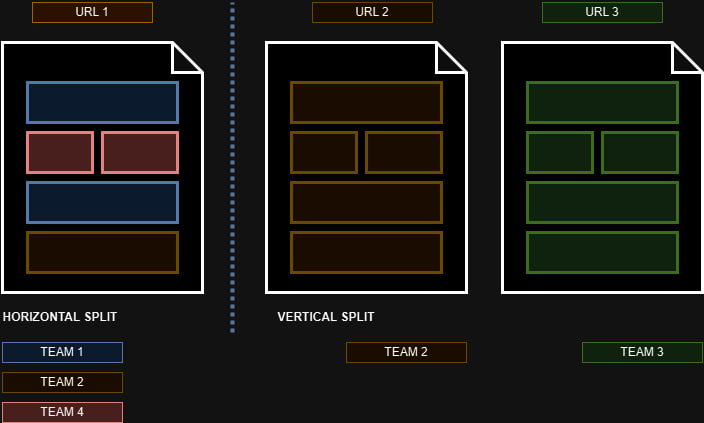

## Why Micro Frontend?

A microfrontend is a software architecture design pattern where the user interface (UI) of a web application is broken down into smaller, self-contained modules called micro frontends.
Each microfrontend is responsible for rendering a specific section or feature of the overall UI, and these modules can be developed, tested, and deployed independently by different teams, often using different technologies or frameworks such as React, Vue, or Angular.

There are 2 main splits in a Micro Frontend architecture as illustrated in the image below.

Regardless of the approach we take, one important rule is applicable: each micro part should be owned by an independent team and map to a unique business domain or unit.

The type of split may come determined by the level of encapsulation, security, independent deployability and need for a consistent UI, requirements.

This architectural pattern is adopted by TSC due to the nature of the product landscape where various teams deliver onto the same Frontend Platform and there is a need to work and scale independently.

## Vertical Split

When we break down a monolithic frontend or design a composable system from the start, one approach is to split it into multiple standalone applications, each accessible through a different URL. This is known as a vertical split.

Vertical splits are particularly useful when a large application contains sections (or domains) with entirely different requirements, release cycles, and independent development teams. In such cases, separating them into distinct applications allows for greater autonomy and scalability.

This is precisely the use case for TSC.
