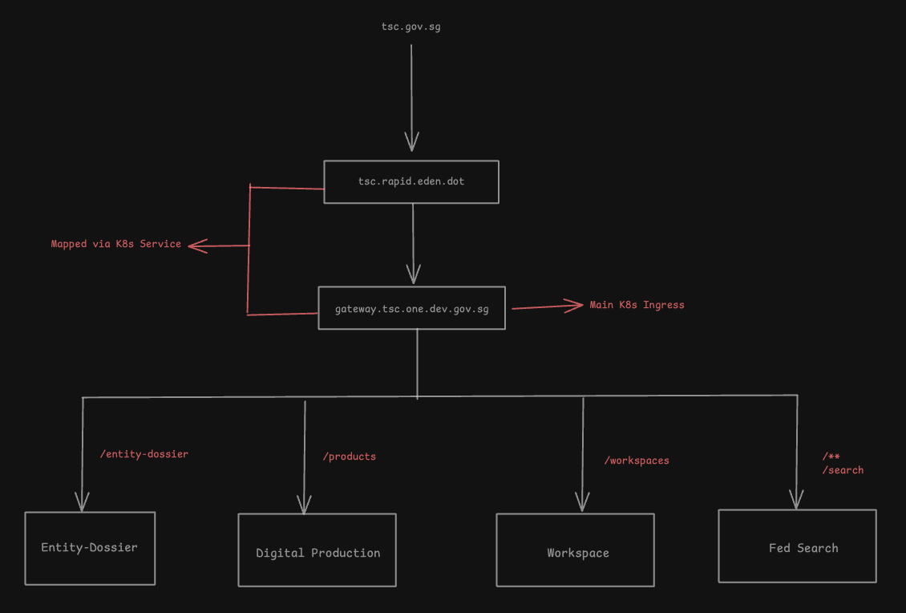

The following diagram illustrates the high level overview of how the deployed architecture looks like.s

TSC is deployed as a rapid service on `rapid.eden.dot` and can technically be accessed via `https://tsc.rapid.eden.dot`

However, due to legacy systems relying on AuthMS which requires windows kerboros login, there is a need to behind the main organization's domain for it to work.
